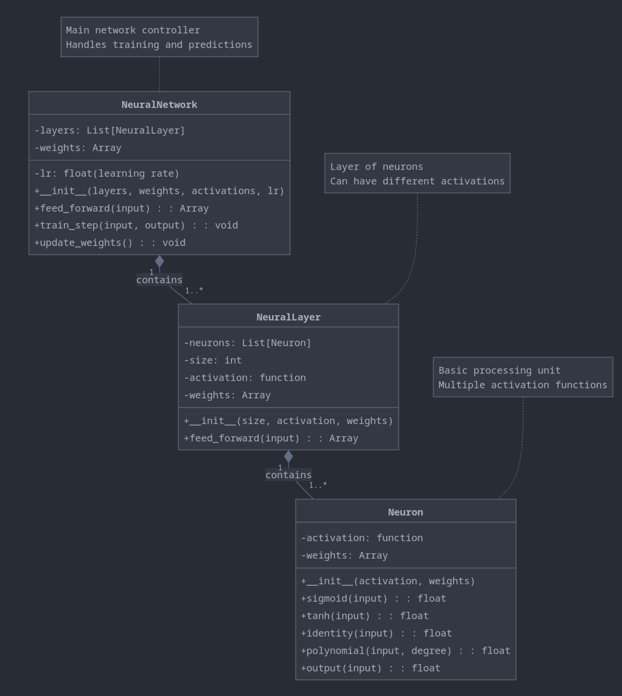

# Neural Networks: From Absolute Scratch to Scikit-learn

## Motivation
Understanding the intricate mechanics of neural networks is crucial for anyone diving deep into machine learning. This project provides a unique, highly educational journey into building a neural network literally from the ground up, minimizing reliance on extensive numerical libraries like NumPy for the core logic. We then contrast this with the practical application of Scikit-learn's powerful NN tools.

## Overview
This repository showcases two key approaches to neural networks:

1.  **From Absolute Scratch Implementation:** A detailed, step-by-step construction of a neural network. This involves creating fundamental components like neurons, layers, and the network itself, along with implementing the forward and backward propagation algorithms with minimal external libraries. The focus is on clarity and understanding the core operations.
2.  **Scikit-learn for Practicality:** An example of using Scikit-learn's `MLPRegressor` and `GridSearchCV` to build, tune, and evaluate a neural network, demonstrating the efficiency of established libraries for real-world tasks.

## What You Will Learn & Explore

*   **The Anatomy of a Neural Network (From Scratch):**
    *   How individual **Neurons** process inputs, apply activation functions, and calculate outputs.
    *   How **Neural Layers** organize neurons and perform layer-wise computations.
    *   How a complete **Neural Network** structure is formed by stacking layers.
*   **Core Algorithms (From Scratch):**
    *   **Feedforward Propagation:** The journey of an input signal through the network to produce a prediction.
    *   **Backpropagation:** The process of calculating error gradients and how they flow backward through the network.
    *   **Weight Updates:** How gradients are used to adjust network weights and "learn."
*   **Activation Functions:** Understanding and implementing common functions (Sigmoid, Tanh, ReLU, etc.) and their derivatives – the backbone of non-linearity and gradient calculation.
*   **Practical NN Application with Scikit-learn:**
    *   Building a regression model using `MLPRegressor`.
    *   Leveraging `GridSearchCV` for efficient hyperparameter tuning (e.g., activation functions, solvers, layer sizes, learning rates).
    *   Evaluating model performance using standard metrics.

## Project Structure: The "From Scratch" Implementation

Our from-scratch neural network is built with a clear, object-oriented approach, emphasizing the fundamental components:

1.  **`Neuron` Class:**
    *   The most basic processing unit.
    *   Manages its own weights (conceptually) and activation function.
    *   Calculates `net_input` and `output` (post-activation).
    *   Stores information needed for backpropagation (e.g., activation derivatives).

2.  **`NeuralLayer` Class:**
    *   A collection of `Neuron` objects.
    *   Handles the forward pass for all its neurons.
    *   Will manage layer-specific aspects of backpropagation.

3.  **`NeuralNetwork` Class:**
    *   The orchestrator, composed of multiple `NeuralLayer` instances.
    *   Manages the overall `feed_forward` process through all layers.
    *   Implements the `backpropagation` algorithm to compute gradients across layers.
    *   Handles `update_weights` for all learnable parameters in the network.
    *   Includes methods for training (`train_step`) and making predictions.



**Key Uniqueness:** This implementation strives for maximal educational value by building these components with minimal reliance on `NumPy` for the core iterative algorithms (forward/backward pass), truly showing the "bare metal" operations.

## Neural Networks with Scikit-learn: A Practical Comparison

To provide a complete learning experience, we also explore how to achieve similar goals using the Scikit-learn library. This section demonstrates:
*   Setting up an `MLPRegressor`.
*   Defining a hyperparameter grid for `GridSearchCV`.
*   Training and evaluating the model.

**Example Snippet (Scikit-learn GridSearchCV):**
```python
import numpy as np
from sklearn import neural_network
from sklearn import model_selection
from Data.load_data import load_data
from sklearn import metrics
import warnings
warnings.filterwarnings("ignore")

parameters = {
    'activation': np.array(['relu', 'tanh', 'logistic']),
    'solver': np.array(['adam', 'sgd', 'lbfgs']),
    'learning_rate': np.array(['constant', 'adaptive']),
    'hidden_layer_sizes': np.array([100, 70, 50, 35, 20, 10, 3, 2]),
    'early_stopping': np.array([False, True]),
}


NN = neural_network.MLPRegressor(max_iter=10_000)


kf = model_selection.KFold(n_splits=3)


search = model_selection.GridSearchCV(NN, cv=kf, param_grid=parameters, scoring='neg_mean_squared_error')


x_train, x_val, y_train, y_val = load_data()

search.fit(x_train, y_train.ravel())

if __name__ == '__main__':
    # retaing the model over the whole data
    model = search.best_estimator_
    print('model from cv score over val'.center(50, '#'))
    print(metrics.mean_squared_error(model.predict(x_val), y_val))
    model.fit(x_train, y_train.ravel())

    print('after training over the whole traning set'.center(50, '#'))
    print(metrics.mean_squared_error(model.predict(x_val), y_val))
    print(f"best score from cv is {-1*search.best_score_=}".center(50, '#'))

    print('best paramters are '.center(50, '#'))
    print(search.best_params_)

```


## Learning Outcomes & Takeaways

*   A foundational, almost "from first principles" understanding of neural network operations.
*   Appreciation for the complexity encapsulated by libraries like Scikit-learn.
*   Insight into the mathematics of feedforward, backpropagation, and gradient-based learning.

## How to Use This Repository

1.  **Explore the "From Scratch" Implementation:** Dive into the `Neuron.py`, `NeuralLayer.py`, and `NeuralNetwork.py` (or similarly named files) to understand the step-by-step logic.
2.  **Run the Scikit-learn Example:** Execute the script using `MLPRegressor` to see a practical application.
3.  **Compare and Contrast:** Reflect on the differences in implementation effort, control, and ease of use between the two approaches.
 