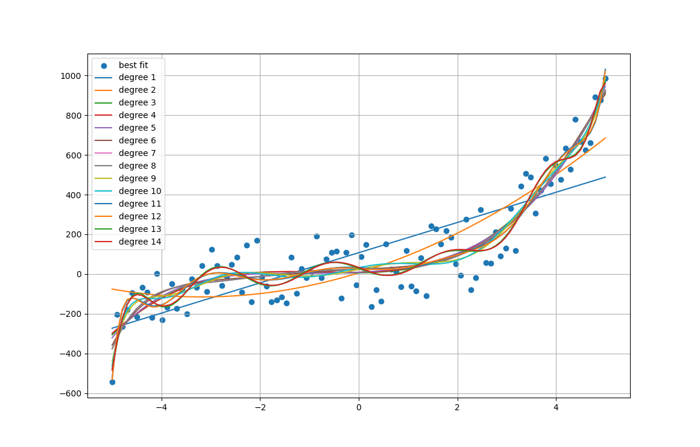
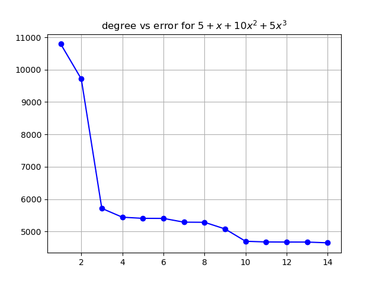
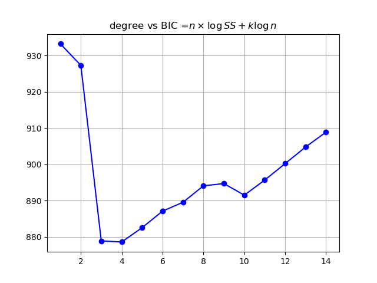

## Polynomial Regression Deep Dive

## Disclaimer

Your understanding of polynomial regression depends significantly on your understanding of linear regression. If you need a refresher, I highly recommend reviewing this tutorial: [Linear Regression Tutorial](https://github.com/omarTBakr/ML-Deep-Dive/tree/main/linear%20regression).

## Required Packages

If you don't have the following packages installed, use `pip`:

```bash
pip3 install matplotlib numpy sklearn
```

1. `matplotlib`
2. `numpy`
3. `sklearn`

## Learning Objectives

1. Identifying scenarios where polynomial regression is appropriate.
2. Fitting a polynomial regression model.
3. Understanding the impact of adding polynomial features.
4. Determining the optimal degree for polynomial features.
5. Utilizing BIC (Bayesian Information Criterion) to assess model overfitting.
6. Using mean squared error as a metric for overfitting evaluation. 

## When to Choose Polynomial Regression over Linear Regression

There are two primary scenarios where polynomial regression outperforms linear regression:

1. **Non-Linear Relationships:** When your input features (independent variables) and output variable (dependent variable) don't exhibit a linear relationship. This can be identified using a correlation matrix.
2. **Underfitting:** When a linear model demonstrates poor performance, indicated by a low performance metric (e.g., high mean squared error).

## Relationship between Linear and Polynomial Regression

Polynomial regression leverages a clever trick. It transforms input features using polynomial basis functions, essentially projecting them into a higher-dimensional space. In this transformed space, a linear relationship might exist between the input and output variables. We can then apply our trusty linear regression to fit a model.

**Key Takeaway:** We introduce non-linearity to our features, but the model fitting itself remains a linear regression problem.

### Example

Consider a single input feature (X) and output variable (Y):

1. **Correlation Check:** We calculate the correlation between X and Y. If it's close to 0, a non-linear relationship is likely.
2. **Polynomial Transformation:** Let's use a 2nd-degree polynomial to transform X: X^0 + X^1 + X^2. 
3. **Linear Model:** We now assume Y = w0*X^0 + w1*X^1 + w2*X^2.
4. **Linear Regression:** We employ linear regression to find the optimal weights (w0, w1, w2).

## Follow Along

**Important Considerations:**

* **Data Preprocessing:**  Preprocess your data before applying polynomial regression to avoid potential issues with NaN values. 
* **Modular Code:** Structure your code into smaller, reusable functions for better organization and readability.

1. **Data Generation:**
   Create a function that generates artificial data based on a specified function:

   ```python
   def generate_uniform_data(func):
       # Example: center equation will be 4*x^2 + 4*X + 6
       X = np.linspace(-5, 5, 100)
       X_new = X.reshape(-1, 1)
       Y = np.array(list(func(value) for value in X_new)).reshape(-1, 1)
       Y = np.add(Y, np.random.randint(-50, 50, 100).reshape(-1, 1))
       return X_new, Y
   ```

2. **Polynomial Degree Exploration:**
   Knowing the underlying function generating the data, we'll experiment with polynomial degrees from 1 (a line) to 14.

3. **Model Fitting Function:**
   Define a function to fit models with different polynomial degrees:

   ```python
   def try_polynomials(X, Y, start=1, end=4):
       '''
       Fits polynomial regression models with degrees ranging from 'start' to 'end'.

       Args:
           X: Independent variables.
           Y: Dependent variables.
           start: Starting degree of the polynomial.
           end: Ending degree of the polynomial.

       Returns:
           A list of named tuples, each containing the degree, error, coefficients,
           number of training examples, fitted model, and polynomial features object.
       '''

       return [Trial(degree, *fit_polynomyal(X, Y, degree)) 
               for degree in tqdm(range(start, end + 1))]
   ```

   Utilize named tuples for organizing results:

   ```python
   Trial = collections.namedtuple('Trial', 'model_degree error N model poly')
   ```

4. **Polynomial Regression Implementation:**
   Create a function to fit a polynomial regression model:

   ```python
   def fit_polynomyal(X, Y, degree):
       '''
       Fits a polynomial regression model of a specified degree.

       Args:
           X: Independent variables.
           Y: Dependent variables.
           degree: Degree of the polynomial.

       Returns:
           Mean squared error.
           Number of training examples.
           Fitted linear regression model.
           Polynomial features object.
       '''

       liner_reg = LinearRegression()
       poly = PolynomialFeatures(degree=degree, include_bias=True)

       X_new = poly.fit_transform(X)  # Transform data to include polynomial features
       liner_reg.fit(X_new, Y)
       error = mean_squared_error(liner_reg.predict(X_new), Y) / 2 
       return error, X.shape[0], liner_reg, poly
   ```

5. **Visualization:**
   Visualize the results using a utility function:

   ```python
   def visualize_trails(X, Y, trials):
       plt.figure()
       plt.scatter(X, Y, label='best fit') 

       for i, trial in enumerate(trials, 1):
           fitted = trial.poly.transform(X)
           plt.plot(X, trial.model.predict(fitted), label=f'degree {i}')

       plt.legend()
       plt.grid()
       plt.show()
   ```

   Sample Output:

   

   Higher polynomial degrees lead to overfitting.

6. **Determining the Optimal Degree:**
   We can assess the best polynomial degree using two methods:

   1. **Mean Squared Error vs. Degree Plot:**

      ```python
      visualize2d(x=list(range(start, end + 1)),
                  y=[trial.error for trial in trials_info],
                  scatter=False,
                  title='degree vs error for $5 + x + 10 x^2 + 5x^3$')
      ```

      Output:

      

      A significant error drop occurs at degree 3, a slight drop at degree 4, then the error plateaus. Beyond this, overfitting is evident. 

   2. **BIC (Bayesian Information Criterion):** 
      BIC provides a statistical measure to estimate the optimal model complexity, penalizing model complexity more heavily than MSE.

      ```python
      visualize2d(x=list(range(start, end + 1)),
                  y=[
                      trial.N * np.log(trial.error) + k * np.log(trial.N)
                      for trial, k in zip(trials_info, range(start, end + 1))
                  ],
                  scatter=False,
                  title=r'degree vs BIC =$n \times \log{SS} +k\log{n}$')
      ```

      Output:

      

      BIC shows a sharp decrease at degree 2, a slight drop at degree 4, and then increases, indicating potential overfitting. 
