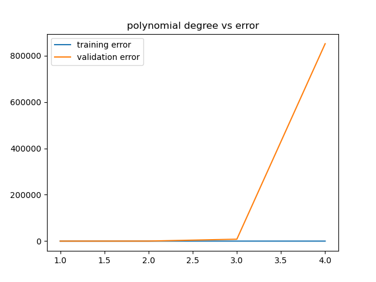
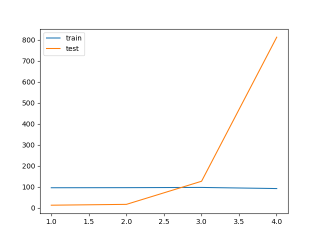
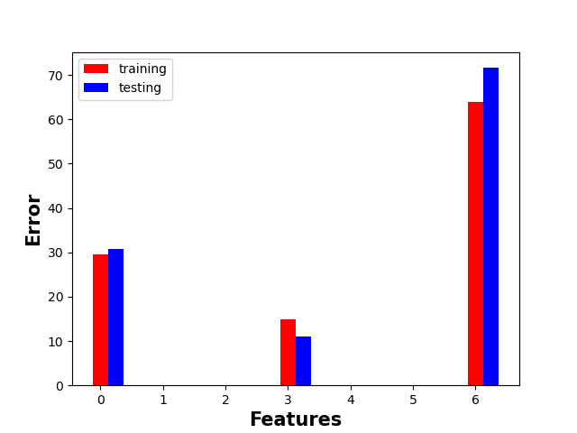
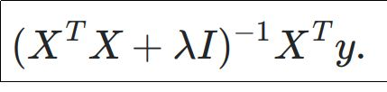

# Regressors & Regularization Deep Dive 
## Required packages 
```bash
pip install numpy sklearn pandas 
```
 
## Learning Objectives
 1. Hands-on concepts on topics such as:
    1. Polynomial regression, I have already a deep dive over it, [here](https://github.com/omarTBakr/ML-Deep-Dive/tree/main/Polynomial%20regression)
    2. Cross-validation 
 
2. Use `sklearn.linear_model`
3. `Ridge` and `Lasso` regularizations
4. `GridSearchCV` tour 
5. Discover the impact of normalizing, standardizing data over the performance 


## Tasks 
1. KISS (keep it simple and stupid) get a baseline model without any modifications
  - *For simplicity, you don't have to split the data into training, validation, and testing at the end of the data. 
   It's just a toy dataset.* Just use `train_test_split` from `sklearn` and keep `test_size = 0.5`
  - Use `root_mean_squared_error` from `sklearn` for evaluation 


2. Transform the data using `sklearn.Polynomial` and save `RMSE` for both training and validation, test with degrees `[1,2,3,4]`. 
   What are your observations?
3. Implement a function called `monomials` which only transforms each feature to the given power only. It does not take into consideration
  the combination between features like the built-in one in `sklearn`. 
   e.g., you have x, and degree 3 for example, then you will transform it to x, x^2, x^3. 
 
    *Try to make it as vectorized as possible*
4. Make a function that takes a 0-based index for the feature and polynomial degree order and plot the error for train vs. validation in a bar plot. 
5. Test the performance with regularization, try `alpha=[0.01, 0.1, 1, 10, 100, 1000, 10000]`, use grid search with k-fold `k=4`. 
6. Use Lasso for feature selection to get the best 10 features you have, check `alpha=[0.01, 0.02, 0.03, 0.04, 0.05, 0.06, 0.07, 0.08, 0.09,
0.1, 0.2, 0.3, 0.4, 0.5, 0.6, 0.7, 0.8, 0.9, 1, 10]`. 
7. Implement regularizing normal regression using NumPy - make a class called `NormalEquationsWithRidge` that implements `fit` and `predict` and make it
compliant with sklearn if you want.
8. Update the code for linear regression in this [repo](https://github.com/omarTBakr/ML-Deep-Dive/blob/main/linear%20regression/cost.py) to include regularization.

9. Create a program that administrates creating a pipeline / `GridSearchCV` that
allows learning Ridge and grid search on:
        
   1. Polynomial features degree `[1, 2, 3]`
   2. Ridge parameters like `alpha`, `fit_intercept`

10. To demonstrate learning how to extend libraries, let's create a class that
performs two steps together.
## My Approach
*Note: If you want to follow up with my solution, you should fix the random state.*
```python

np.random.seed(17)
```
You will find the toy dataset in the `Data` folder also; the data is cleaned, no feature engineering is required.
1. Make a `Data` directory to hold the data within. 
2. Make a simple `data_utility.py` to handle all data requirements.
3. Make a function to load the data. 
```python 
 def get_data_split_numpy():
    data = get_numpy()

    return data[:, :-1], data[:, -1]

```
4. Get the data and split it. 
```python 

x , y = get_data_split_numpy()
x_train,x_test , y_train,y_test = model_selection.train_test_split(
                            x,y ,
                            shuffle= False ,
                            random_state=17 , test_size=0.5)
 
```
5. For the `LinearRegression` without normalization:
```python
model = linear_model.LinearRegression(fit_intercept=True)
model.fit(x,y)
base_line_error = metrics.root_mean_squared_error(
    model.predict(x_test) ,
    y_test
                                )
```
6. For normalization,
here are the steps:
   1. Make the scaler fit the data. 
   2. Use the scaler to transform the data. 
   *Train and evaluation data should be done separately to avoid any data leakage.*


```python
scaler = preprocessing.MinMaxScaler()
scaler.fit(x_train)


model.fit(scaler.transform(x_train), y_train)

error_after_normalization = metrics.root_mean_squared_error(
    model.predict(scaler.transform(x_test) ) ,
    y_test
)
```
7. Make a file that contains all `Polynomial` trials just for organizational purposes.  
8. Make a simple utility function called `fit_polynomial`. 
   Here is a sample:
```python 
def fit_polynomial(model, x, y, degree=1):
    
    poly = preprocessing.PolynomialFeatures(degree=degree)
    poly.fit(x)
    model.fit(poly.transform(x), y)
    return model, poly
 
```
9. Plot the train, validation error vs. the degree order. 


 

*Notice how the model is overfitting the data after [specify degree] and the performance degradation due to that.*

10. Make another module for `monomial.py` just for the sake of organization.
11. Here are my implementations for the function `monomial_features`:
```python
def monomail_features(degree,x:np.array):
    transformed = x
    for degree in range(2,degree+1):
        transformed = np.hstack((transformed,np.power(x,degree)))

    return transformed


```
*And here is the error curve:*




*You can observe that the model is overfitting the data just after the second monomial degree.*

12. The function is exactly the same except for the plotting part; here is my approach to it: 
```python 
def test_individual_features(*features, degree=None):
    if degree is None:
        degree = [1, 2, 3]
    x_train, x_test, y_train, y_test = train_test_split_data()
    model = linear_model.LinearRegression(fit_intercept=True)
    train_errors,test_errors = [] ,[]

    for feature  in features:
        for degree in degrees:
            selected_train  , selected_test= x_train[:,feature].reshape(-1,1), x_test[:,feature].reshape(-1,1)

            model, poly = fit_polynomial(model, selected_train, y_train, degree)
            train_errors.append(calc_RMSE(
                model, poly.transform(selected_train), y_train
            ))
            test_errors.append(
                calc_RMSE(model, poly.transform(selected_test), y_test)
            )


    return train_errors, test_errors

```
*And the plotting:*
```python
    degree =[1]
    features = [ 0 ,3 ,6 ]
    train, test  = test_individual_features(*features , degree= degrees)

    print(f'{train=}\n,{test=}')
    plt.figure()
    bar_width = 0.25
    plt.bar(features , train ,width= bar_width , color ='r',
            label ='training')
    plt.bar([feature + bar_width for feature in features], test, width=bar_width, color='b',
            label='testing')

    plt.xlabel('Features',fontweight ='bold', fontsize = 15)

    plt.ylabel('Error', fontweight='bold', fontsize=15)

    plt.legend(loc = 'best')
    plt.show()

```

13. Again, make a module for regularization.  
 Here is my approach:
 1. Make the grid search which contains all the hyperparameters you want to search over. 
 2. Make the k-fold, or you can directly use `cv=number_of_splits`.
 3. Put it all together in `GridSearchCV`.
 4. Fit the estimator, and you can infer it to get the best performance indicators. 

```python

from utility import train_test_split_data
from sklearn import linear_model,preprocessing,model_selection
import warnings
import matplotlib.pyplot as plt

warnings.filterwarnings("ignore")


model = linear_model.Ridge()
param_grid = {'alpha':[0.01, 0.1, 1, 10, 100, 1000, 10000],
              'fit_intercept':[True , False]
              }
kf = model_selection.KFold(n_splits=4)
search = model_selection.GridSearchCV(
    model , param_grid= param_grid ,
    cv = kf , scoring ='neg_root_mean_squared_error'
)

# get the data
x_train,x_test , y_train,y_test = train_test_split_data()
poly =  preprocessing.PolynomialFeatures(degree=2)
poly.fit(x_train)
search.fit(poly.transform(x_train),y_train)

```
14. This one was a bit tricky. Using Lasso for feature selection, you can divide this into two parts:
 1. Is to find the best model. 
 2. Select the best n features according to that model.
 *The first part is almost identical to the previous task.*

```python

x_train,x_test, y_train, y_test = train_test_split_data()

param_grid  = {'alpha':[0.01, 0.02, 0.03, 0.04, 0.05, 0.06, 0.07, 0.08, 0.09,
0.1, 0.2, 0.3, 0.4, 0.5, 0.6, 0.7, 0.8, 0.9, 1, 10],
               }
model = linear_model.Lasso(fit_intercept=True)


search = model_selection.GridSearchCV( model , param_grid=param_grid ,
                                       cv = 4 ,
                                       scoring='neg_root_mean_squared_error')

search.fit(x_train,y_train)
print(f'{search.best_estimator_=}, {-1*search.best_score_=}')
```
*The second part is to choose the best 10 features.*
*Here is my approach, and it could be implemented in a more nicer way, but here we are!*

```python
selector = feature_selection.SelectFromModel(
    estimator= search.best_estimator_ ,

).fit(x_train,y_train)
# print(dir(selector))
boolean_support = selector.get_support()
print([index for index,value in  enumerate(boolean_support) if value][:10])

```
17. Implement the normal equation regularized, should be straightforward.
Here is the equation:


```python 
class NormalEquationWithRidge(BaseEstimator):
    def __init__(self, alpha):
        self.alpha = alpha
        super().__init__()

    def fit(self, X:np.array,y:np.array):
        self.model :np.array =np.linalg.inv(X.T@X+self.alpha* np.identity(X.shape[1])
                                  )@X.T@y
        return self

    def predict(self,X):
        return X@self.model.T

    def coef_(self):
        return self.model.tolist()


```
18. Updating the unregularized linear regression.
 This should be trivial since you will only add `alpha/2 W^2` to the cost function and update the derivative with respect to weights.

```python
import numpy as np


def cost(X: np.array, Y: np.array, W: np.array, alpha: float):
    # add new column of ones to X
    # X_new =np.hstack((np.ones(( X.shape[0] , 1)) , X) )
    N = X.shape[0]
    # return np.sum(
    #     np.square(error(X ,Y,W))
    #         )/N/2
    _error = error(X, Y, W)
    return (_error.T @ _error) / N / 2 + alpha / 2 * np.square(W)

def cost_der(X: np.array, Y: np.array, W: np.array, alpha: float):
    X_new = np.hstack((np.ones((X.shape[0], 1)), X))
    N = X.shape[0]
    return X_new.T @ error(X, Y, W) / N + alpha*W

```
19. There is a subtle point with making a pipeline with those requirements which you should abbreviate 
the parameters for the grid search with the name of the corresponding variable like below: 
```python 
pipeline = Pipeline(
    [
        ('scaler', preprocessing.MinMaxScaler()),
        ('Poly', preprocessing.PolynomialFeatures(include_bias=False)),
        ('Ridge', linear_model.Ridge()),
    ]
)
p_grid = {'Ridge__alpha': [1, 0.1, 10],
          'Poly__degree': [1, 2, 3],
          'Ridge__fit_intercept': [True, False]}

```

20. Extend again from `BaseEstimator` and implement `fit` and `predict`.
```python

class SpecialPoly(BaseEstimator):

    def __init__(self, /,alpha , degree , fit_intercept):
        self.alpha = alpha
        self.degree = degree
        self.poly = PolynomialFeatures(degree=degree)
        self.fit_intercept = fit_intercept

    def fit(self , x, y):
        self.poly = self.poly.fit(x)
        x_transformed = self.poly.transform(x)
        self.model = Ridge(alpha=self.alpha,
                           fit_intercept=self.fit_intercept
                           )
        self.model.fit(x_transformed,y)

        return self

    def predict(self , x):
        return self.model.predict(
            self.poly.transform(x)
        )


```

