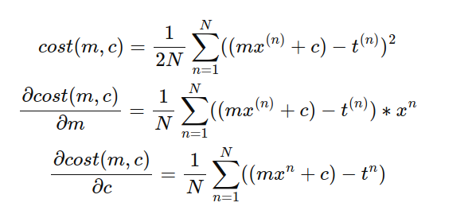
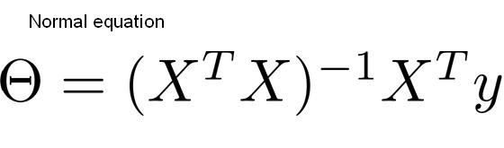
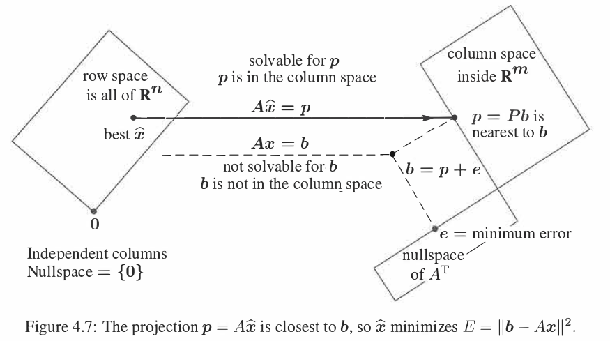

# Mastering Linear Regression from Scratch: A Hands-On Tutorial

## Motivation:
Linear regression is a fundamental machine learning algorithm used extensively in different areas . it's the backbone of lots of machine
learning algorithms . This tutorial provides a hands-on approach to understanding its core principles by building it from the
ground up.

## Overview

This tutorial guides you through the process of implementing linear regression from scratch using Python. By following this tutorial, you will gain a deep understanding of the underlying mathematics and algorithms, as well as practical skills in implementing them.


## What You Will Learn

1. **Gradient Descent Implementation**:
    - Derive and implement the cost function.
    - Derive and implement the gradient of the cost function.
    - Validate your implementation using numerical differentiation.

2. **Hyperparameter Tuning**:
    - Explore and fine-tune hyperparameters to optimize model performance.

3. **Model Visualization**:
    - Visualize model performance metrics and behavior during training.

4. **Data Preprocessing**:
    - Apply Min-Max Scaling and Standardization techniques.

5. **Linearity Investigation**:
    - Assess the linear relationship between features and the target variable.
    - Train a model based on these relationships and compare its performance.

6. **Normal Equation Implementation**:
    - Implement and understand the normal equation as an alternative to gradient descent.
    - Compare its time complexity with gradient descent.

7. **Effective Solution Structuring**:
    - Organize your solution into modular and reusable components.

8. **Usage of `collections.namedtuple`**:
    - Implement `namedtuple` for clean and efficient data handling.

## Required Packages

To follow along, install the following Python packages:

1. `numpy` for numerical computations:
    - `pip install numpy`
2. `pandas` for data manipulation:
    - `pip install pandas`
3. `scipy` for scientific computing:
    - `pip install scipy`
4. `scikit-learn` for machine learning tools:
    - `pip install scikit-learn`
    - We will use:
      - `mean_squared_error`
      - `MinMaxScaler`
      - `StandardScaler`
5. `matplotlib` for plotting:
    - `pip install matplotlib`
6. `seaborn` for data visualization:
    - `pip install seaborn`
7. `tqdm` for progress bars:
    - `pip install tqdm`
8. `black` for code formatting:
    - `pip install black`

## Problem Statement

### Tasks

1. **Implement the Cost Function**:
    - Derive and implement the cost function in code.

2. **Implement the Gradient of the Cost Function**:
    - Derive and implement the gradient (derivative) of the cost function.

### Equations



*Note: You should implement the cost function in two ways:*
1. Using iterations (less efficient but instructive).
2. Using the vectorization capabilities of NumPy (preferred).

3. **Validate Using Numerical Differentiation**:
    - Learn about numerical differentiation if unfamiliar.
    - Implement a numerical gradient checker to validate your derivative. Use methods like:
      - `math.isclose`
      - `numpy.isclose`
      - `numpy.linalg.norm`
    - Utilize `scipy.optimize.check_gradient` for additional validation.

4. **Data Exploration**:
    - Explore the provided dataset in the `DataProcessing` directory.
    - Apply `MinMaxScaler` and evaluate its impact on model performance.
   here is a snippet of what I have done
   ```python
        import matplotlib.pyplot as plt
        import seaborn as sns
        import pandas as pd 
        def some_data_insights(df, label='no transformation'):  # data frame object containing the data
            print('investigating data'.center(100, '*'))
            plt.figure(label)
            sns.pairplot(df)

            # lets see some info about the data
            print("head of the data".center(100, '#'))
            print(df.head())

            print('correlation matrix'.center(100, '#'))
            plt.figure(label)
            corr_matrix = df.corr()
            print(corr_matrix)

            print("columns in the data".center(100, '#'))
            print(df.columns)

            print("statistical information about the data".center(100, '#'))
            print(df.describe())

            print('more infor about each column'.center(100, '#'))
            print(df.info())

            plt.figure(label)
            # visualizing correlation matrix
            sns.heatmap(corr_matrix)
            plt.show()
   ```

5. **Hyperparameter Optimization**:
    ```python
    # Test different step sizes and precisions:
    step_sizes = [0.1, 0.01, 0.001, 0.0001, 0.00001, 0.000001]
    precisions = [0.01, 0.001, 0.0001, 0.00001]
    ```

6. **Use `collections.namedtuple` to Capture Test Specifications**:
    - Store results like minimum error, optimal weights, iterations, step size, and precision.

7. **Model Retention**:
    - Save the model trained with the best hyperparameters.

8. **Result Visualization**:
    - Plot the error over iterations for the best model.

9. **Effect of Scaling Data**:
    - Compare the performance using `MinMaxScaler` and `StandardScaler`.

10. **Linearity Investigation**:
    - Use a correlation matrix to investigate linearity between features and the target.

11. **Model Training Based on Correlation**:
    - Select the feature with the highest correlation to the target.
    - Train and evaluate a model using this feature.

12. **Normal Equation Implementation Using NumPy**:
    
    - Implement the normal equation using NumPy.
    - Explore how different preprocessing techniques affect the normal equation's outcome.
      **Why this equation!**
      
    *Notice: the explanation below assumes*
        -  A is the data Matrix
        -  x is the optimal weights
        - y is the target variable
    _sorry for that, but I hope after this explanation you will be able to comprehend this amazing   image below_

    **Let's go!**
    - since data 99% comes in a rectangle shape which means that there is no absolute solution for Ax = b
    - Therefore  we tend to minimize the error between our  prediction and the ground truth aka 
	minimize (b-Ax or better-minimizing score error (b-Ax)^2 _in calculus language_
    - in linear algebra, we say b is not in the column space of A thus we project b into the column             space of A, introducing an error term you guessed it!  (b-Ax) 
	- this error term is perpendicular to the column space of A as the image shows
	- which means that A^T *  error =0 
	- which means that A^T * (b-Ax) =0
	- which lead to A^T * A x = A^T * b

    for more information please check[introduction to linear algebra 5.th edition , chapter 4 .Orthogonality . Least squares](https://math.mit.edu/~gs/linearalgebra/ila5/indexila5.html)

this whole explanation is summarized in this beautiful image :) 


13. **Time Complexity Analysis**:
    - Compare the time complexity of linear regression (O(n * k * d)) and the normal equation (O(d^3)).
    - Determine which method is preferable based on your data size and structure.

## Approach

1. **Organize Your Project**:
    - Create a directory to store your data and related functionalities, such as `DataProcessing`.

2. **Data Exploration**:
    - Check for any missing values.
    - Create a correlation matrix.
    - Visualize the dataset using `sns.pairplot(dataFrame)`.
    - Implement these tasks in `DataProcessing/investigateData.py`.

3. **Data Loading**:
    - Write a module to load data as needed, like `DataProcessing/load_data.py`.

4. **Data Preprocessing**:
    - Implement preprocessing steps in `DataProcessing/preprocessing.py`.

5. **Cost Function Implementation**:
    - Start with an iterative approach, then optimize using NumPy's vectorization.
    - See `cost.py` for the implementation.

6. **Validate the Gradient Implementation**:
    - Implement a pseudo gradient checker (`pseudo_gradient_check`).
    - Use `scipy.optimize.check_grad` for additional validation. Refer to the [scipy documentation](https://docs.scipy.org/doc/scipy/reference/generated/scipy.optimize.check_grad.html).
    - Example:
      ```python
      def cost_flattened(W_flattened, X, Y):
          W = W_flattened.reshape(-1, 1)  # Reshape W inside
          return cost(X, Y, W).item()

      def cost_der_flattened(W_flattened, X, Y):
          W = W_flattened.reshape(-1, 1)  # Reshape W inside
          return cost_der(X, Y, W).flatten()  # Return flattened gradient

      # Check the gradient
      print('Gradient using scipy'.center(100, '*'))
      error = check_grad(cost_flattened, cost_der_flattened, W.flatten(), X, Y)
      print("Gradient check error:", error)
      ```

7. **Gradient Descent Implementation**:
    - Implement the full gradient descent algorithm in `gradientDescent.py`.
    - Use existing cost and gradient implementations.

8. **Hyperparameter Testing**:
    - Write a utility function to test different hyperparameters.
    - Use `namedtuple` to store the best results:
      ```python
      import collections 
      
      Iteration = collections.namedtuple('Iteration', 'error optimal_weights iterations step_size precision processor')
      ```

9. **Retain the Best Model**:
    - Use the best hyperparameters from the tests to train the model again, potentially lowering the learning rate:
      ```python
      errors = [iteration.error for iteration in hyperparameters_info_all_features]

      # Interested in minimum error
      minimum_error = np.min(errors)
      print(minimum_error)

      index = errors.index(minimum_error)
      # Train the model using the best hyperparameters
      best_hyperparameters = hyperparameters_info_all_features[index]
      cost, optimal_weights, iterations = gradient_descent_linear_regression(
          *best_hyperparameters.processor(*load_data()),
          step_size=best_hyperparameters.step_size,
          precision=0.1 * best_hyperparameters.precision,
          max_iter=10_000,
      )
      ```

10. **Visualize the Results**:
    - Implement visualization functions to plot the results, available in `utility/visualize.py`.

11. **Select the Best Feature**:
    - Identify the feature with the highest absolute correlation with the target.
    - Function available in `load_data.py` as `load_best_feature`.

12. **Single Feature Model Evaluation**:
    - Evaluate model performance using the single best feature.

13. **Normal Equation Implementation**:
    - Implement the normal equation and assess its performance:
      ```python
      def normal_equation(X, Y):
          # Pad X with ones for intercept
          X_new = np.hstack((np.ones((X.shape[0], 1)), X))
          # Solve the linear system A x = b
          A, b = X_new.T @ X_new, X_new.T @ Y
          return np.linalg.solve(A, b)
      ```

14. **Understand the Normal Equation**:
    - The matrix A often does not have an inverse, so we multiply by its transpose to get a full-rank matrix.
    - Use `np.linalg.solve` for efficient computation.

15. **Evaluate Different Preprocessing Techniques**:
    - Test the impact of various preprocessing techniques on the normal equation's performance.
    - Note that the normal equation usually yields the best results without needing hyperparameter tuning.

16. Reformat the code using `black`
    
    ```bash
    python -m black -l 120 -S *

    ```
    `-l 120` to change the default line length
    `-S` to keep string as single quote
    `*` wild char to format all files in the current directory

18. **Time Complexity**:
    - Linear Regression: ( O(n * k * d) )
    - Normal Equation: ( O(d^3) 
